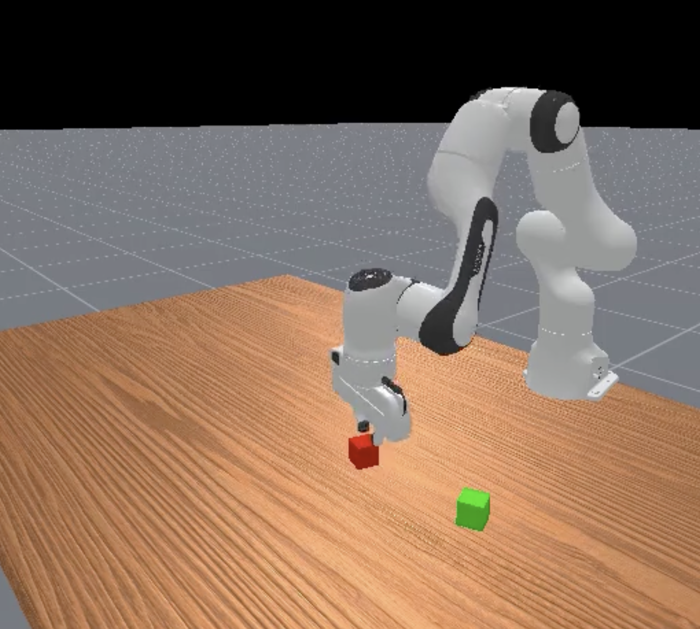

# openpi-maniskill
This repo deploys the [openpi](https://github.com/Physical-Intelligence/openpi) policy on [ManiSkill](https://github.com/haosulab/ManiSkill) simulation. 

Files are provided to run $\pi_0$ inference on ManiSkill's [Franka Emika Panda](https://maniskill.readthedocs.io/en/latest/robots/panda/) robot. 



## Setup
Download ManiSkill3 following the instructions on [repo](https://github.com/haosulab/ManiSkill).

Then clone this repo:
```bash
git clone --recurse-submodules git@github.com:eyerisshe/openpi-maniskill.git
```

## Guide
Edit files to adapt to your own datasets, norm stats, training steps, etc.
- `inference.py`: run script to run inference with different environments
- `panda_policy.py`: adapting franka panda robot inputs and outputs 
- `config.py`: contains `pi0_panda_lora` config

I provide normalization stats and a [checkpoint](https://huggingface.co/datasets/eyerisshe/vla-checkpoints) briefly fine-tuned on [RDT-1B's ManiSkill dataset](https://huggingface.co/robotics-diffusion-transformer/maniskill-model). Due to my resource constraints, only a _subset_ of the dataset is used: 50% of PickCube-v1 and 50% of StackCube-v1. The checkpoint performance is low as it has only been trained for a few steps, but it hopefully serves as a guide on how to create and load in your own checkpoints.
- `load_rdt_data.sh`: script to help download RDT team's ManiSkill dataset
- `assets`: directory contains norm stats based on the data _subset_ (though they should automatically be loaded in if using `pi0_panda_lora` checkpoint)
- Uncomment code blocks in `inference.py` to use `pi0_panda_lora` checkpoint + norm stats instead of the `pi0_base` checkpoint

I hope this is a beginner-friendly guide that can help clarify how to adapt $\pi_0$ to simulators!
